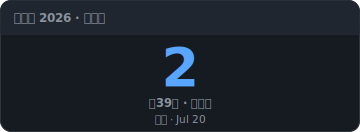
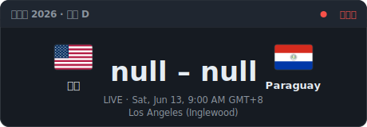
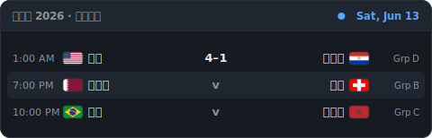
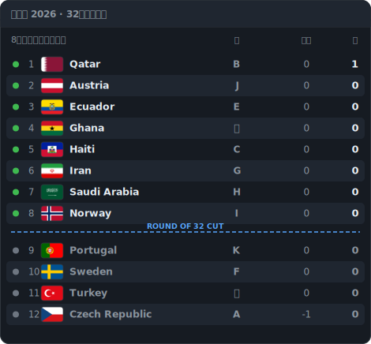
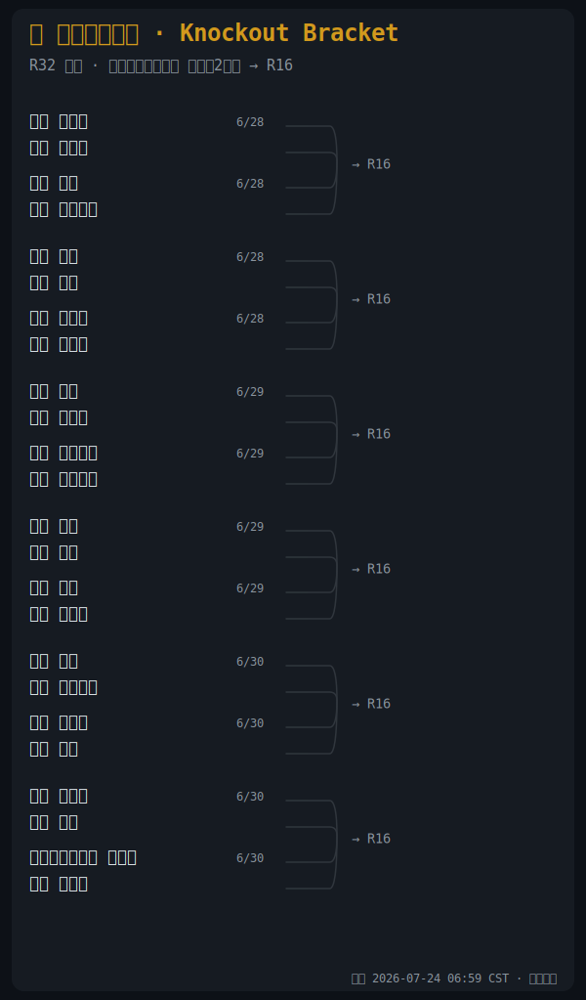

# ⚽ World Cup 2026 README Widget / 世界杯 2026 动态看板

> 自动更新的 FIFA 2026 世界杯面板，每 6 小时通过 GitHub Actions 刷新。
> Self-updating FIFA World Cup 2026 panels — auto-refreshed every 6 hours via GitHub Actions.

基于 / Powered by [moose25/world-cup-2026-readme-widget](https://github.com/moose25/world-cup-2026-readme-widget)

---

## 📊 面板 / Panels

| 面板 Panel | 中文 | English |
|---|---|---|
| 🕐 Countdown | 距开幕倒计时 | Days to kickoff |
| ⚽ Match | 正在进行的比赛 / 下一场 | Live or next match |
| 📅 Today | 今日全部赛程（北京时间）| Today's fixtures (Asia/Shanghai) |
| 🏆 R32 | 48 队晋级 32 强追踪 | Round-of-32 qualification tracker |
| 🌲 Bracket | 淘汰赛对阵树 | Knockout bracket |

<!-- WC26:START -->





<!-- WC26:END -->

---

## 🌲 淘汰赛对阵图怎么看 / How to Read the Bracket

2026 世界杯首次扩军至 **48 队**，淘汰赛从 **32 强**（Round of 32）开始，不再像往年那样从 16 强起步。

```
32强 (R32)    →    16强 (R16)    →    8强 (QF)    →    半决赛 (SF)    →    决赛 (Final)
 16 场比赛           8 场比赛           4 场比赛          2 场比赛            1 场比赛
```

> The 2026 World Cup expands to 48 teams. The knockout stage starts from the **Round of 32** — not the Round of 16 like previous tournaments.

### 阅读方向 / Reading Direction

```
    ← 从左到右 →  /  ← Left to Right →
    
   [32强]  ────  [16强]  ────  [8强]  ────  [半决赛]  ────  [决赛]
    R32          R16          QF           SF              Final
```

每场比赛的**胜者**沿连线进入下一轮。连线的交汇点就是下一轮的比赛。

> The **winner** of each match advances along the connecting line to the next round.

### 状态说明 / Status Guide

| 显示 | 含义 |
|---|---|
| **美国** 🇺🇸 | 已确定的对阵队伍 / Confirmed team |
| `TBD` | 待定（等待上一轮结果）/ To Be Determined |
| **2 : 1** | 最终比分 / Final score |
| `- : -` | 比赛尚未进行 / Match not yet played |

---

## 🔧 工作原理 / How It Works

- **数据源 / Data**: [openfootball/worldcup.json](https://github.com/openfootball/worldcup.json)（公共领域，无需 API Key）
- **渲染 / Render**: 每个面板是一个 SVG 图片，直接嵌入 Markdown
- **更新 / Update**: GitHub Actions 定时运行 → 拉取最新数据 → 生成 SVG → 中文化翻译 → 自动提交
- **时区 / Timezone**: `Asia/Shanghai`（北京时间 UTC+8）
- **翻译 / Translation**: `scripts/translate_svg.py` 对标签、队名、状态进行中文化处理
