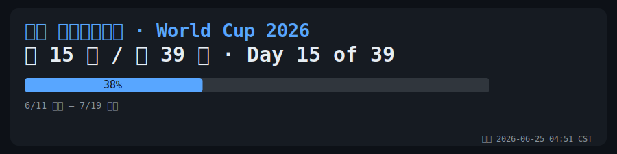
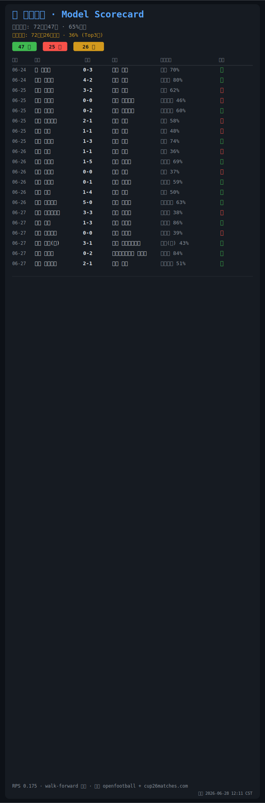
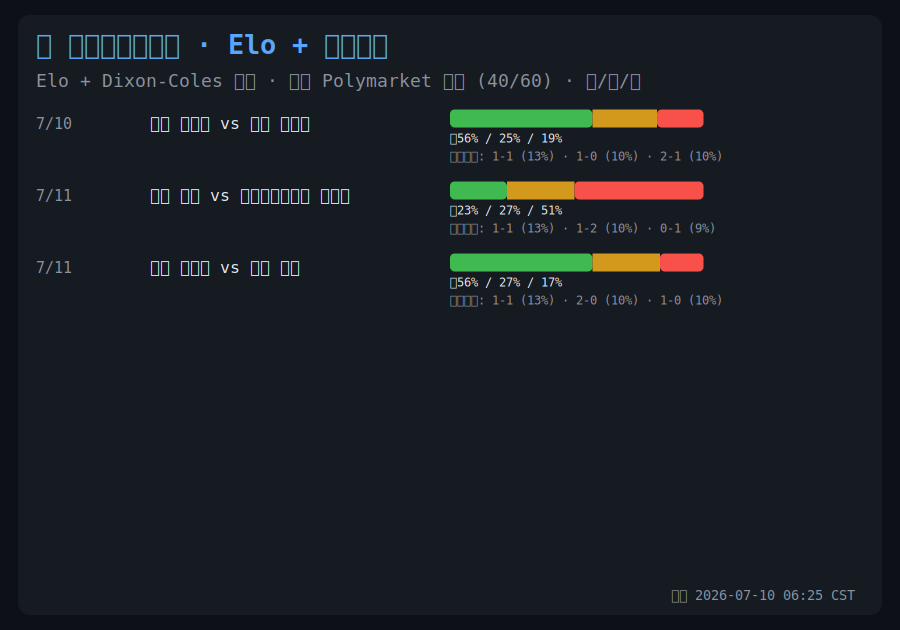
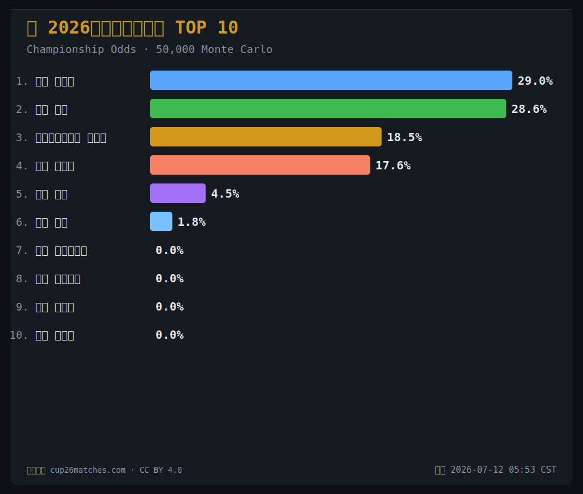
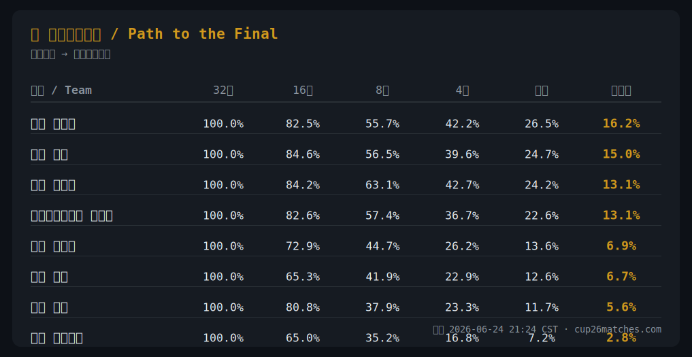
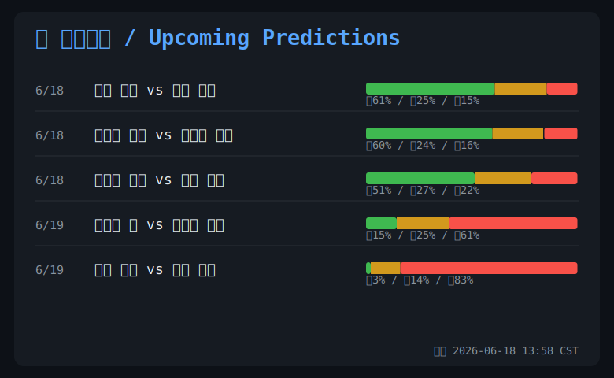

# ⚽ World Cup 2026 README Widget / 世界杯 2026 动态看板

> 自动更新的 FIFA 2026 世界杯面板，每小时通过 GitHub Actions 刷新。
> Self-updating FIFA World Cup 2026 panels — auto-refreshed every hour via GitHub Actions.

数据 / Data: [openfootball](https://github.com/openfootball/worldcup.json) · [cup26matches.com](https://cup26matches.com)

---

## 📊 世界杯进度 / World Cup Progress

<!-- WC26:START -->

<!-- WC26:END -->

---

## 🧠 AI 预测面板 / AI Prediction Panels

> 数据来源：**cup26matches.com** — Elo 评级 + Dixon-Coles 双变量泊松 + 50,000 次蒙特卡洛模拟
> Data: cup26matches.com (CC BY 4.0) — Elo + Dixon-Coles bivariate Poisson + 50k Monte Carlo

| 面板 Panel | 中文 | English |
|---|---|---|
| ⚽ Next Match | 接下来6场胜平负预测 | Next 6 matches W/D/L % |
| 🏆 Championship | 夺冠概率 TOP 10 | Championship odds top 10 |
| 🛤️ Path to Final | 通往决赛之路晋级概率 | Stage-by-stage advancement % |
| 📊 Qualification | 小组赛出线概率 | Group qualification odds |

<!-- WC26-PREDICTIONS:START -->

<!-- WC26-PREDICTIONS:END -->

---

## 🔧 工作原理 / How It Works

- **赛程数据 / Fixtures**: [openfootball/worldcup.json](https://github.com/openfootball/worldcup.json)
- **预测数据 / Predictions**: [cup26matches.com/data/probabilities.json](https://cup26matches.com/data/probabilities.json)
- **渲染 / Render**: SVG 图片直接嵌入 Markdown
- **更新 / Update**: GitHub Actions 每小时自动运行
- **时区 / Timezone**: `Asia/Shanghai`（北京时间 UTC+8）
